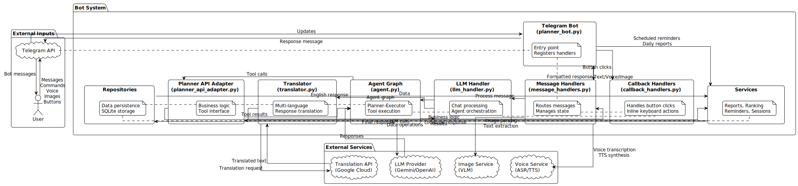
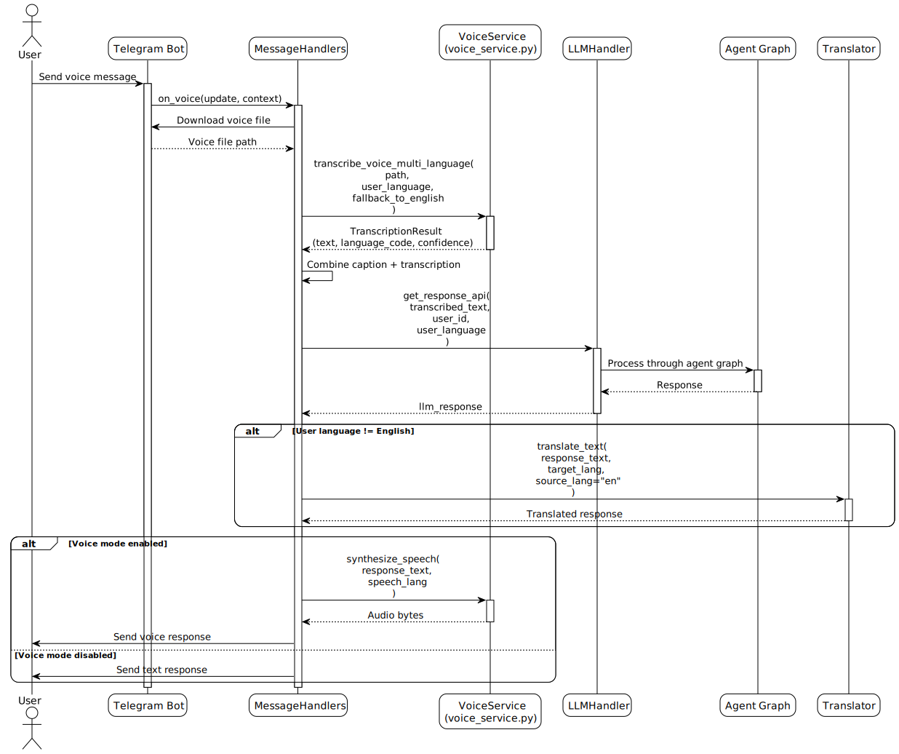
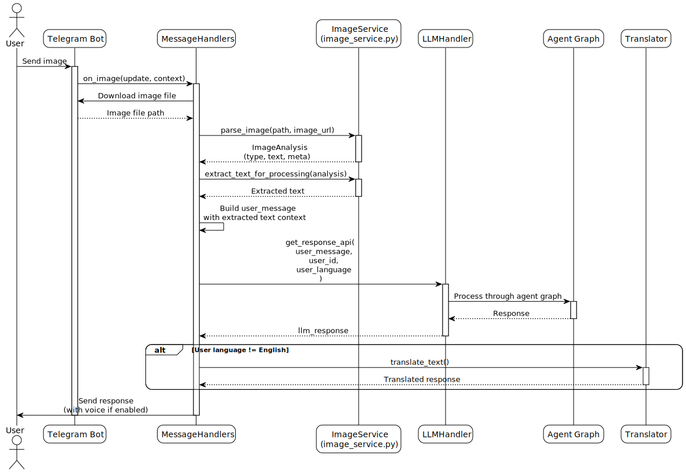
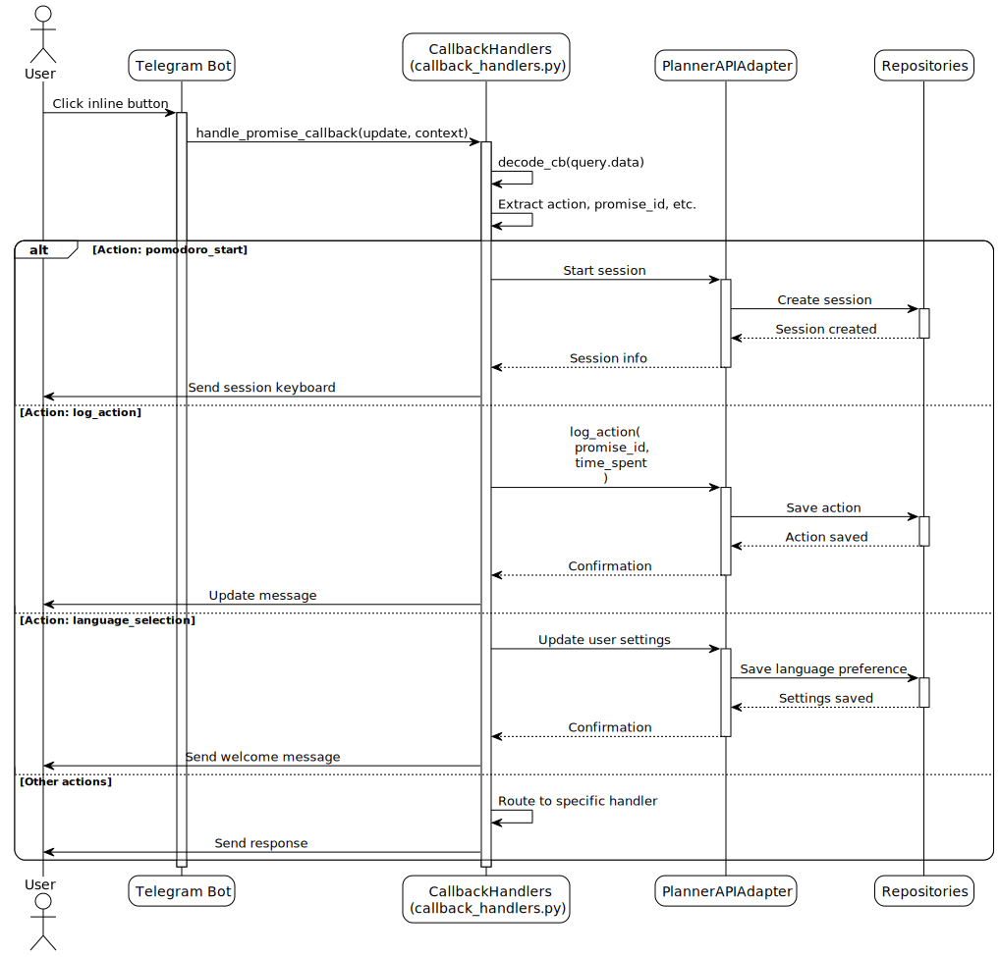
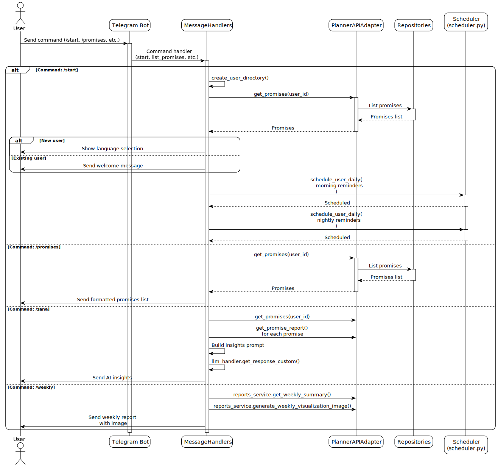

# Chat Flow Documentation

This document contains UML sequence diagrams showing the system hooks, inputs, and user flows when chatting with the bot.

## System Overview



This high-level diagram shows the overall system architecture:
- **External Inputs**: User interactions via Telegram API
- **Bot System**: Core components handling messages, LLM processing, and business logic
- **External Services**: LLM providers, translation, voice, and image services
- **Data Layer**: Repositories for persistent storage

Key flows:
- **Input**: User messages → Telegram → Bot → Handlers
- **Processing**: Handlers → LLM → Agent Graph → Tools → Services → Repositories
- **Translation**: LLM responses → Translator → External API → Localized output
- **Output**: Processed responses → Bot → Telegram → User

## Main Text Message Flow


This diagram shows the complete flow when a user sends a text message:
- Message routing through Telegram Bot and MessageHandlers
- LLM processing via Agent Graph (Planner → Executor pattern)
- Tool execution through PlannerAPIAdapter
- Translation placement (after LLM response)
- Response formatting and sending

## Voice Message Flow



Shows how voice messages are processed:
- Voice file download and transcription
- Multi-language transcription support
- LLM processing of transcribed text
- Optional voice synthesis for responses

## Image Message Flow



Shows how image messages are processed:
- Image download and parsing via ImageService
- Text extraction from images
- LLM processing of extracted content
- Response with optional voice mode

## Callback Query Flow (Button Clicks)



Shows how inline button clicks are handled:
- Callback data decoding
- Routing to specific action handlers
- Database operations via PlannerAPIAdapter
- Response updates

## Command Flow (e.g., /start, /promises)



Shows how commands are processed:
- Command routing to specific handlers
- Database queries for user data
- Scheduled job setup
- Response generation

## Component Overview

### Key Components and Their Roles

1. **Telegram Bot (planner_bot.py)**
   - Entry point for all Telegram updates
   - Registers handlers for commands, messages, callbacks
   - Manages application lifecycle

2. **MessageHandlers (message_handlers.py)**
   - Routes incoming messages to appropriate handlers
   - Handles text, voice, image messages
   - Manages user state (pending clarifications)
   - Coordinates translation and formatting

3. **LLMHandler (llm_handler.py)**
   - Main interface to LLM processing
   - Manages chat history per user
   - Invokes agent graph for multi-step reasoning
   - Returns structured responses

4. **Agent Graph (agent.py)**
   - Implements plan-execute pattern
   - **Planner**: Creates structured plan (JSON) without calling tools
   - **Executor**: Executes plan steps (tool calls, user questions, responses)
   - Manages iteration limits and state

5. **Translator (translator.py)**
   - Translates LLM responses to user's preferred language
   - Uses Google Cloud Translation API
   - Implements caching to reduce API calls

6. **PlannerAPIAdapter (planner_api_adapter.py)**
   - Provides unified interface to planner functions
   - Wraps repositories and services
   - Methods exposed as tools to LLM agent

7. **Repositories**
   - Direct database access layer
   - PromisesRepository, ActionsRepository, SettingsRepository, etc.

8. **Services**
   - Business logic layer
   - ReportsService, RankingService, RemindersService, etc.

## Simplified Text Flow Diagram

```
User sends message
    ↓
Telegram Bot (planner_bot.py)
    ↓
MessageHandlers.handle_message()
    ├─→ Check user exists → /start if new
    ├─→ Check pending clarification → Parse slot fill values
    ├─→ Check URLs → ContentService.process_link()
    └─→ Normal text message
        ↓
    LLMHandler.get_response_api()
        ↓
    Agent Graph (LangGraph)
        ├─→ PLANNER: Create plan JSON (no tools)
        │   └─→ Planner Model (Gemini/OpenAI)
        │
        └─→ EXECUTOR: Execute plan steps
            ├─→ Tool step → Tool Wrappers → PlannerAPIAdapter → Repositories
            ├─→ Ask user step → Set pending_clarification
            └─→ Respond step → Responder Model → Final response
        ↓
    LLM returns: {response_to_user, executed_by_agent, pending_clarification}
        ↓
    MessageHandlers processes response
        ├─→ If error → Translate error → Send to user
        ├─→ If legacy mode → call_planner_api() → Execute function
        └─→ Normal flow
            ├─→ If user_lang != "en" → Translator.translate_text()
            ├─→ Formatter.format_response_html()
            └─→ Send to user
```

## Key Decision Points

1. **User Check**: New users are routed to `/start` command
2. **Pending Clarification**: If previous message asked for missing info, the current message is treated as the answer
3. **URL Detection**: Messages with URLs are routed to content processing
4. **LLM Processing**: All text messages go through the agent graph
5. **Translation**: Happens AFTER LLM response (LLM responds in English, then translated)
6. **Tool Execution**: Can happen in two ways:
   - **Modern**: Agent graph executes tools directly during execution phase
   - **Legacy**: MessageHandlers calls `call_planner_api()` after LLM response

## Component Locations

- **Entry Point**: `tm_bot/planner_bot.py` - `PlannerTelegramBot` class
- **Message Routing**: `tm_bot/handlers/message_handlers.py` - `MessageHandlers` class
- **LLM Processing**: `tm_bot/llms/llm_handler.py` - `LLMHandler` class
- **Agent Graph**: `tm_bot/llms/agent.py` - `create_plan_execute_graph()` function
- **Translation**: `tm_bot/handlers/translator.py` - `translate_text()` function
- **Tool Execution**: `tm_bot/services/planner_api_adapter.py` - `PlannerAPIAdapter` class
- **Response Formatting**: `tm_bot/utils/formatting.py` - `format_response_html()` function

## Notes

- **Translation happens AFTER LLM processing**: The LLM typically responds in English, then the translator converts it to the user's language
- **Agent executes tools directly**: The agent graph calls tools during execution, not after planning
- **Pending clarifications**: When the agent needs more info, it's stored in `context.user_data` for the next message
- **Voice mode**: If enabled, responses are synthesized as voice messages instead of text
- **Legacy mode**: Some responses may still use `call_planner_api` for backward compatibility
- **Planner-Executor Pattern**: The agent uses a two-phase approach:
  1. **Planner** creates a structured plan (JSON) without calling tools
  2. **Executor** runs the plan step-by-step, calling tools as needed

## Compiling Diagrams

To regenerate the SVG diagrams from PlantUML source files:

**On Linux/macOS:**
```bash
cd docs
chmod +x compile_diagrams.sh
./compile_diagrams.sh
```

**On Windows (PowerShell):**
```powershell
cd docs
.\compile_diagrams.ps1
```

**Manual compilation:**
```bash
plantuml -tsvg -o diagrams/svg diagrams/*.puml
```

Make sure PlantUML is installed:
- macOS: `brew install plantuml`
- Ubuntu/Debian: `sudo apt-get install plantuml`
- Windows: `choco install plantuml`
- Or download the JAR from https://plantuml.com/download

